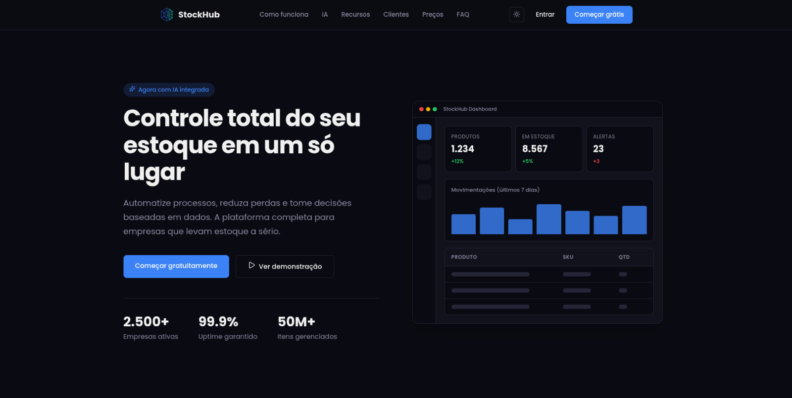
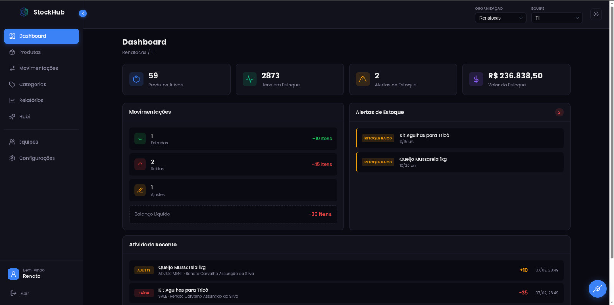
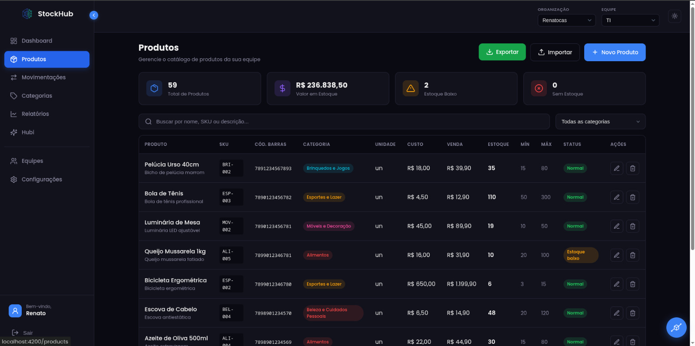
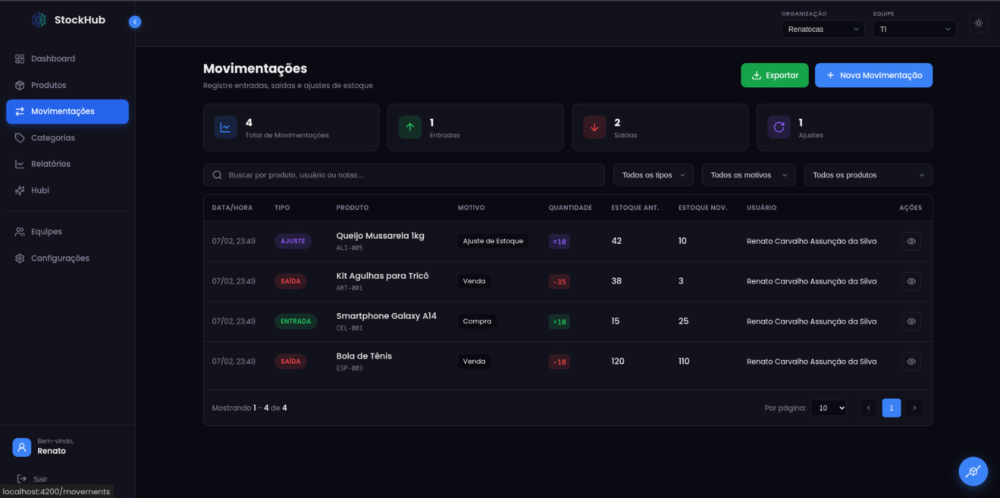
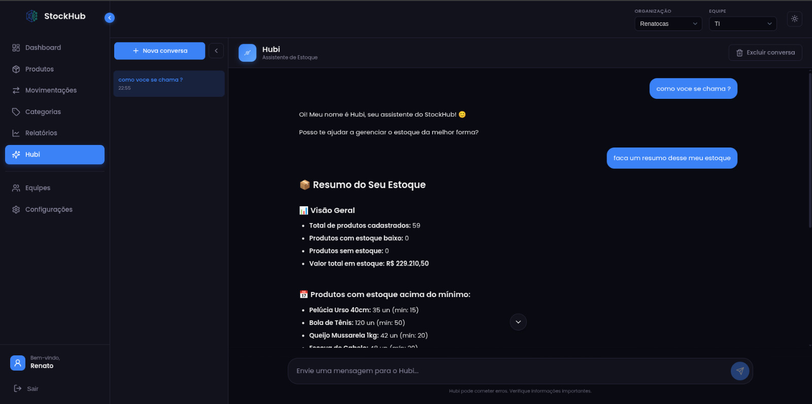

# StockHub

Sistema completo de gestão de estoque com assistente de IA integrado, desenvolvido como projeto de portfólio e aprendizado.


## Screenshots

<details>
<summary>Landing Page</summary>


</details>

<details>
<summary>Dashboard</summary>


</details>

<details>
<summary>Produtos</summary>


</details>

<details>
<summary>Movimentações</summary>


</details>

<details>
<summary>Chat com IA (Hubi)</summary>


</details>

## Funcionalidades

- **Dashboard** - Visão geral com métricas, alertas de estoque baixo, atividade recente e resumo financeiro
- **Produtos** - CRUD completo com importação/exportação em massa (Excel), código de barras, SKU e controle de estoque mínimo/máximo
- **Movimentações** - Registro de entradas, saídas e ajustes com rastreabilidade (estoque anterior/novo) e histórico por usuário
- **Categorias** - Organização de produtos com cores e importação/exportação
- **Relatórios** - Análise ABC, tendências de estoque e exportação em PDF/Excel
- **Chat com IA (Hubi)** - Assistente inteligente com streaming em tempo real que consulta dados do seu estoque
- **Equipes** - Multi-tenancy com organizações, equipes e controle de permissões (Owner/Admin/Member)
- **Autenticação** - Login com e-mail/senha, Google e GitHub, com refresh token automático
- **Dark mode** - Tema claro e escuro

## Stack

### Frontend

- **Angular 21** - Standalone Components + Signals
- **TypeScript 5.9**
- **Chart.js** - Gráficos e visualizações
- **ngx-markdown** - Renderização de markdown nas respostas da IA
- **Lucide** - Biblioteca de ícones
- **xlsx / file-saver** - Exportação de planilhas

### Backend

- **NestJS** - Framework Node.js
- **Prisma ORM** - Acesso ao banco de dados
- **PostgreSQL** - Banco de dados relacional
- **Server-Sent Events (SSE)** - Streaming de respostas da IA

## Como rodar

### Pre-requisitos

- Node.js 18+
- npm
- PostgreSQL
- Backend ([stockhub-api](link-do-repo-backend)) rodando em `http://localhost:4000`

### Instalação

```bash
# Clone o repositório
git clone https://github.com/seu-usuario/stockhub.git

# Instale as dependências
cd stockhub
npm install

# Inicie o servidor de desenvolvimento
npm start
```

A aplicação estará disponível em `http://localhost:4200`.

### Build

```bash
npm run build
```

## Arquitetura

```
src/app/
├── core/
│   ├── services/          # Serviços (auth, product, chat, etc.)
│   ├── interceptors/      # Interceptor HTTP com refresh token
│   └── guards/            # Guards de rota (auth, guest, team-admin)
├── features/
│   ├── landing/           # Landing page
│   ├── login/             # Login
│   ├── register/          # Registro
│   ├── home/              # Dashboard
│   ├── product/           # Gestão de produtos
│   ├── category/          # Categorias
│   ├── movement/          # Movimentações de estoque
│   ├── reports/           # Relatórios
│   ├── chat/              # Chat com IA
│   ├── team/              # Gestão de equipes
│   └── settings/          # Configurações
├── shared/components/     # Componentes reutilizáveis
└── layout/                # Layout principal (sidebar + header)
```

## Licenca

Este projeto foi desenvolvido para fins de aprendizado e portfólio.
